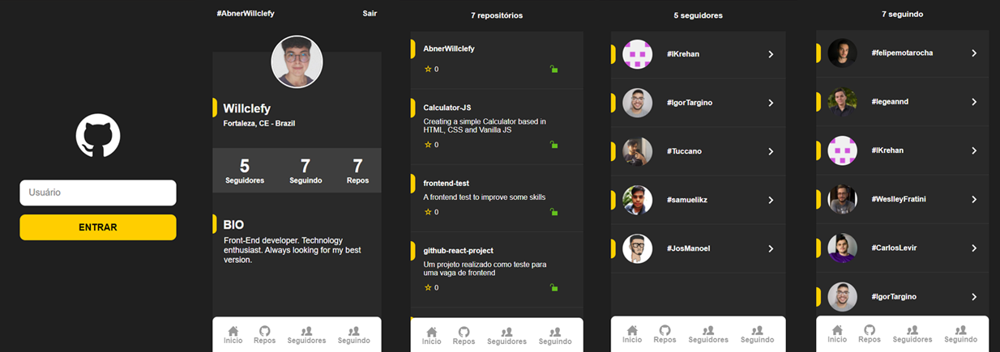

<h3 align="center">GitHubUser-React</h3>

  

  
  
  
    
   
  

---

 Um projeto criado em React para criação exibição de um usuário Github
      

## 🧐 Sobre o projeto 

Este projeto exibe o perfil de um usuário do github, listando suas informações, 

## 🎨 Layout

### Telas

  

  
  

## :video_game: Link para o projeto 
:point_right: [Github-user-react](https://github-user-react.vercel.app)

## 🎈 Utilidades

- Pesquisar usuário
- Listar informações do perfil
  - Foto do perfil
  - Localização
  - Bio
  - Quantidade de seguidores e perfis seguidos
- Listar repositórios
  - Quantidade de estrelas de cada repositório
- Listar seguidores
- Listar perfis seguidos
- Navegar nos perfis dos usuarios seguidos e seguidores

## 🚀 Tecnologias utilizadas 

- <code></code>
- <code></code>

## 🎉 Conhecimentos Adquiridos

- React Hooks
- Context API
- React Router DOM
- Styled Components
- Axios

## 🌟 Autor 🌟

- [@AbnerWillclefy](https://github.com/AbnerWillclefy)

